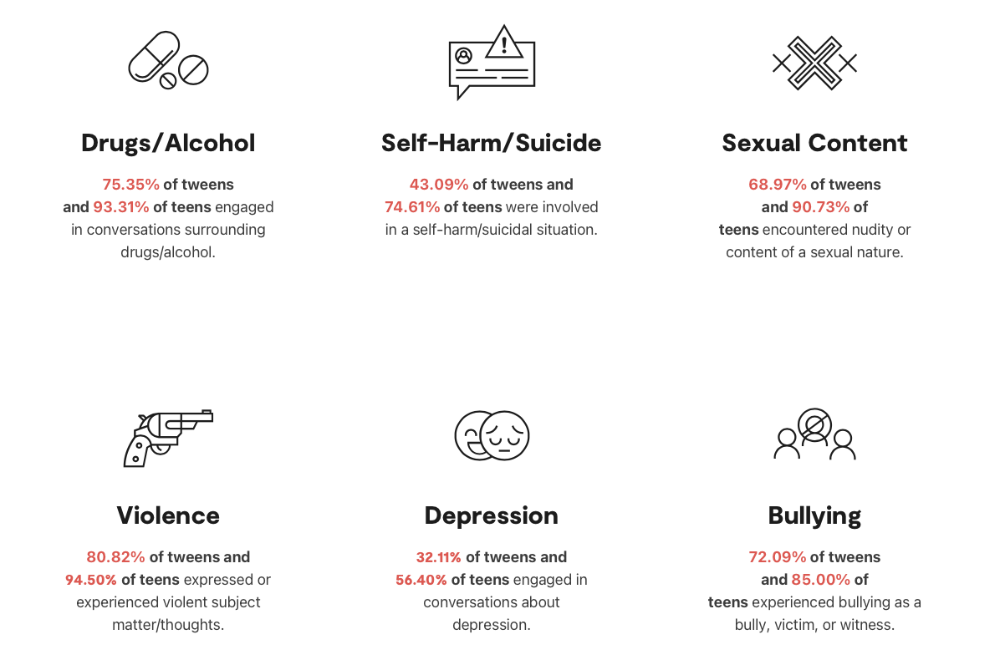

# Detecting Cyberbullying with NLP

**Author**: Greg Burgess


## Overview

Parents find it extremely difficult to monitor their children's social media interactions for cyberbullying and toxic comments. I trained several machine learning models to detect toxic comments in over 500,000 social media comments. The best machine learning model could be used to provide alerts to parents when these issues arise online. Ultimately, these parental alerts could ameliorate some of the risks that children experience online.


## Business Problem

According to a surveys from the CDC, nearly 16 percent of students in grades 9–12 reported experiencing cyberbullying. The percentage was twice as large for females (20.4%) as males (10.9%), and nearly twice as large for students identifying as gay, lesbian, or bisexual (26.6%) as those identifying as heterosexual (14.1%). [source](http://nces.ed.gov/programs/coe/indicator/a10#6)

However, these may be underestimates of the prevalence of cyberbullying. In 2021, Bark (a parental control app) analyzed 3.4 billion messages and found that 85% of teens experienced or witnessed cyberbullying at some point during 2021. [source](https://www.bark.us/annual-report-2021/)

[](https://www.bark.us/annual-report-2021/)

Parents struggle to keep their kids and teens safe, especially online. Very few products that monitor internet usage can also monitor the *content* teens see while they are online. There are some products being developed that offer APIs to moderators and service providers to monitor for dangerous content posted by their users. But those products only provide feedback to moderators, not to the parents of children that were exposed to those comments.

I developed a machine learning model that can identify cyberbullying and other toxic comments in online text comments. This service could be utilized to protect children from toxic comments by alerting parents to these occurrences, thereby enabling them to discuss these issues with their children.

## Data

The data I used to train the model came from a set of roughly two million comments collected by the [Civil Comments](https://medium.com/@aja_15265/saying-goodbye-to-civil-comments-41859d3a2b1d) platform. [Jigsaw](https://jigsaw.google.com), a subsidiary of Google that explores various threats across the internet, provided human ratings of different subtypes of toxicity in those comments. The comments and rating labels were released in csv format on [Kaggle](https://www.kaggle.com/competitions/jigsaw-unintended-bias-in-toxicity-classification/data)

All comments were rated by up to 10 human raters, who were asked whether the comment contained several different subtypes of toxicity. These categories include:
- `toxicity`
- `severe_toxicity`
- `obscene`
- `threat`
- `insult`
- `identity_attack`
- `sexual_explicit`

The values for each category label reflect the proportion of human raters who assessed that subtype of toxicity in the comment. I created a single binary `target` variable by reviewing comments, determining appropriate thresholds for each category, and flagged comments containing any subtype of toxicity above those thresholds.


## Methods

The comment text and ratings are stored in csv files, and I read the data into a Pandas DataFrame. 

The ratings labels are floating point values ranging from 0.0 to 1.0, reflecting the proportion of human raters who determined the comment included that subtype of toxicity. I engineered a binary target for classification. Specifically, the `target` label flagged comments that exceeded thresholds (chosen by me) for any of the subsets of toxicity that were included. Using these criteria, roughly 17% of the posts are considered positive targets. Although the proportion of toxic posts is small, the total number of toxic posts is approaching 340,000. Consequently, I chose to undersample the negative class in order to avoid class imbalance while training the model.

The `comment_text` feature is stored as a single continuous text string for each record, which required standard "Bag of Words" preprocessing techniques for NLP. This includes text cleaning, removing stop words, tokenization, lemmatization, and vectorization. Using the CountVectorizer method in sci-kit learn, we get a set of features representing a the number of occurrences of words in each comment.

I trained several different models to use these features to predict the target label. Specifically, I tested the performance of multinomial naive bayes and logistic regression algorithms to distinguish the positive and negative target classes.

For this classification problem, there are costs for both false positives and false negatives. False negatives (i.e., labeling toxic posts as non-toxic) are cases of cyberbullying that were missed, and negative effects of that cyberbullying will be unaddressed. On the other hand, false positives (i.e., labeling non-toxic posts as toxic) can reduce trust in the predictive model and result in parents choosing to ignore potential warnings. To balance sensitivity to both types of errors, during both training and evaluation, I used the F1-score as the metric for model performance.


## Results


Present your key results. For Phase 1, this will be findings from your descriptive analysis.

***
Questions to consider:
* How do you interpret the results?
* How confident are you that your results would generalize beyond the data you have?
***

Here is an example of how to embed images from your sub-folder:

### Visual 1


## Conclusions

- GDPR data portability requires that users can download their personal data, or inport to other apps

Provide your conclusions about the work you've done, including any limitations or next steps.

***
Questions to consider:
* What would you recommend the business do as a result of this work?
* What are some reasons why your analysis might not fully solve the business problem?
* What else could you do in the future to improve this project?
***

## Repository Navigation

Please review my [presentation](./DS_Project_Presentation.pdf) for a quick overview, or my full analysis in my Jupyter notebooks [link](./dsc-phase1-project-template.ipynb).

For any additional questions, please [email](mailto:gcburgess@gmail.com) or connect via [LinkedIn](https://www.linkedin.com/in/Greg-Burgess).


```
├── README.md					<- The top-level README for reviewers of this project
├── Presentation.pdf				<- PDF version of project presentation
├── 01-data-understanding-work.ipynb		<- Notebook containing data exploration
├── 02-data-preprocessing.ipynb			<- Notebook containing NLP preprocessing
├── 03-pipelines-and-models.ipynb		<- Notebook containing pipelines and model selection
├── data					<- Both sourced externally and generated from code
└── images					<- Both sourced externally and generated from code
```
